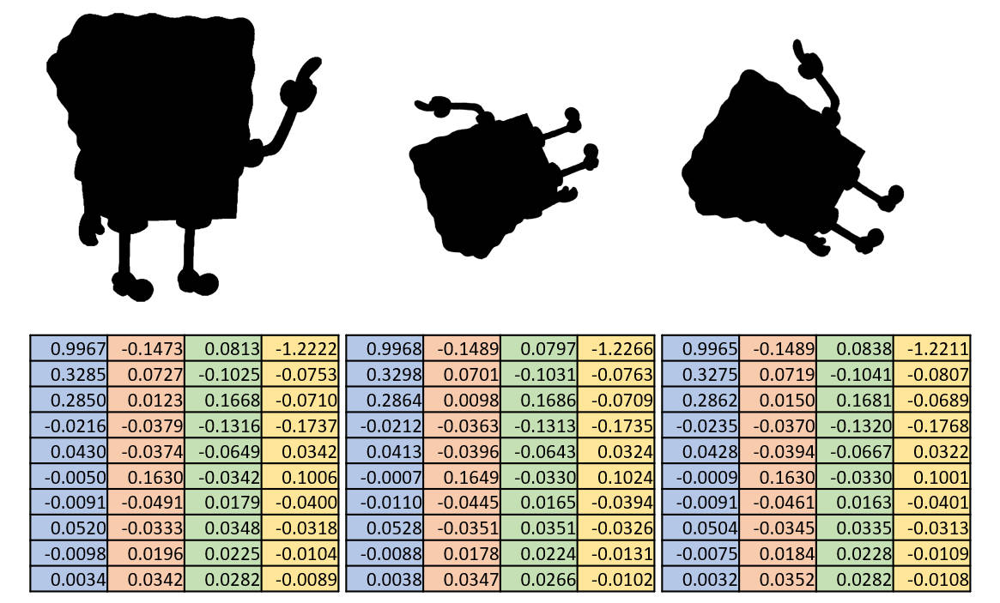

# EllipticFourierDescriptor
Python implementation and interpretation of "Elliptic Fourier Features of a Closed Contour" with **enhanced start point and rotation normalization methods**.

# 1 Introduction
Python implementation and interpretation of "Elliptic Fourier Features of a Closed Contour" with enhanced start point and rotation normalization methods.
In the code, the point having the maimum distance from the centroid is selected as the start point and the rotation is normalized by aligning the start point with horizontal axis of the coordiante system

# 2 Dependency and installation
The **EllipticFourier module only depends on numpy**, thus any python environment having numpy installed is feasible to run the code. Download the file "EllipticFourier.py" and copy the file to your working direction. **OpenCV and matplotlib is required to run all examples**.

# 3 Usage
Given a closed contour of a shape, generated by e.g. OpenCV, this package can fit a Fourier series approximating the shape of the contour.

## 3.1 Basic usage
Using elliptic Fourier descriptor to describe the shape of SpongeBob. Here we used 10 elliptic Fourier coefficients to describe the shape.


``` python
import numpy as np
import cv2

from EllipticFourier import EllipticFourier

# load an image
img_src = "SpongeBob.jpg"
img = cv2.imread(img_src)

# extract image contour
gray = cv2.cvtColor(img, cv2.COLOR_BGR2GRAY) # conver to gray image
_, binary = cv2.threshold(gray, 127, 255, cv2.THRESH_BINARY_INV) # threshold to get binary image. Note that in the example image, the forground is back, thus we use cv2.THRESH_BINARY_INV.
contours, _ = cv2.findContours(binary, cv2.RETR_EXTERNAL, cv2.CHAIN_APPROX_NONE) # find all possible contours
contour = np.squeeze(contours[0]) 

# forward elliptic Fourier
efDescriptor = EllipticFourier()

A0, C0, coeffs = efDescriptor.forward(contour=contour, N=10)
print(f"A0: {A0}")
print(f"C0: {C0}")
print("Coefficients:")
print(coeffs)

# backward elliptic Fourier and plot reconstructed contour
reconstructed_contour = efDescriptor.backward(M=4096) # M determines how many points of the reconstructed contour
cv2.drawContours(img, np.around(reconstructed_contour).astype(np.int32).reshape((-1,1,2)), -1, (0, 0, 255), 2, cv2.LINE_AA)
cv2.imwrite("example1.jpg", img)
```
[Link to codes file.](examples/example1.py)

Running the following scripts, you will get $A_0$, $C_0$ and all 10 group of coefficients.
```python
A0: 500.32974835623213
C0: 512.9862975766608
Coefficients:
[[-124.16782725 -331.41636558 -329.99128026  232.88912794]
 [ -78.04208755  -60.82582495  -66.03245759  -26.06059374]
 [   0.9755801   -24.00522499 -104.851157    -39.06491599]
 [  -3.58647986  -51.69773256    1.07226335   54.5695385 ]
 [ -30.71359422   -5.70036968   -1.9184519     3.19809928]
 [  -2.10359673   -9.16108099   55.73271607  -33.88256265]
 [   4.60579685    5.11983397  -19.0496939     9.76848141]
 [   1.94547198   -1.32610621  -22.03017032  -14.17918943]
 [   8.34267328    6.48530055    2.94044438   -2.37734919]
 [   9.6104728     6.48107343    7.25323288   -6.96029392]]
```

## 3.2 Reconstruct contour with different numbers of coefficients
Reconstruct contour with different numbers of coefficients. The more numbers of coefficients, the more accurate the reconstructed contour. All the reconstructed contour overlay on images were saved in directory named example2.

<p align="center">

</p>

```python
import os
import numpy as np
import cv2

from EllipticFourier import EllipticFourier

# load an image
img_src = "SpongeBob.jpg"
img = cv2.imread(img_src)

# extract image contour
gray = cv2.cvtColor(img, cv2.COLOR_BGR2GRAY) # conver to gray image
_, binary = cv2.threshold(gray, 127, 255, cv2.THRESH_BINARY_INV) # threshold to get binary image. Note that in the example image, the forground is back, thus we use cv2.THRESH_BINARY_INV.
contours, _ = cv2.findContours(binary, cv2.RETR_EXTERNAL, cv2.CHAIN_APPROX_NONE) # find all possible contours
contour = np.squeeze(contours[0]) 

# forward elliptic Fourier
efDescriptor = EllipticFourier()

efDescriptor.forward(contour=contour, N=100) # only forward elliptic Fourier

# reconstruct contour using different numbers of coefficients and save results
dst = "example2"
if not os.path.exists(dst):
    os.mkdir(dst)
for num in range(1, 100+1):
    reconstructed_contour = efDescriptor.backward(M=4096, modeStart=1, modeNum=num)
    raw_img = img = cv2.imread(img_src)
    cv2.drawContours(raw_img, np.around(reconstructed_contour).astype(np.int32).reshape((-1,1,2)), -1, (0, 0, 255), 2, cv2.LINE_AA)
    image_with_text = cv2.putText(raw_img, f"Mode numbers: {num}", (5,25), cv2.FONT_HERSHEY_SIMPLEX, 1, (0, 0, 0), 2, cv2.LINE_AA)
    cv2.imwrite(os.path.join(dst, f"img_{num:0>4}.jpg"), raw_img)
```

[Link to codes file.](examples/example2.py)

## 3.3 Translation, start point, rotation and scale invariance
3 same shapes of SpongeBob were parameterized using elliptic Fourier descriptor. The coefficients of them are almost the same due to the existence of margin error.



```python
import numpy as np
import cv2

from EllipticFourier import EllipticFourier

def extract_contour(img_src):
    # load an image
    img = cv2.imread(img_src)

    # extract image contour
    gray = cv2.cvtColor(img, cv2.COLOR_BGR2GRAY) # conver to gray image
    _, binary = cv2.threshold(gray, 127, 255, cv2.THRESH_BINARY_INV) # threshold to get binary image. Note that in the example image, the forground is back, thus we use cv2.THRESH_BINARY_INV.
    contours, _ = cv2.findContours(binary, cv2.RETR_EXTERNAL, cv2.CHAIN_APPROX_NONE) # find all possible contours
    contour = np.squeeze(contours[0])
    return contour

contour = extract_contour("SpongeBob.jpg")
contour1 = extract_contour("SpongeBob1.jpg")
contour2 = extract_contour("SpongeBob2.jpg")

efDescriptor = EllipticFourier()

efDescriptor.forward(contour=contour, N=100)
coeffs = efDescriptor.normalize(rotation=True, scale=True)

efDescriptor.forward(contour=contour1, N=100)
coeffs1 = efDescriptor.normalize(rotation=True, scale=True)

efDescriptor.forward(contour=contour2, N=100)
coeffs2 = efDescriptor.normalize(rotation=True, scale=True)

np.savetxt("coeffs.txt", coeffs)
np.savetxt("coeffs1.txt", coeffs1)
np.savetxt("coeffs2.txt", coeffs2)
```

[Link to coeds file.](examples/example3.py)

## 3.4 Using elliptic Fourier descriptor to classify shapes
The shape of 3 different SpongeBob were described using elliptic Fourier descriptor. Principal component analysis was performed to reduce and classify shapes.


```python
import numpy as np
import cv2
import matplotlib.pyplot as plt

from EllipticFourier import EllipticFourier

# load an image
img_src = "SpongeBobs.jpg"
img = cv2.imread(img_src)

# extract image contour
contours = []
gray = cv2.cvtColor(img, cv2.COLOR_BGR2GRAY) # conver to gray image
_, binary = cv2.threshold(gray, 127, 255, cv2.THRESH_BINARY_INV) # threshold to get binary image. Note that in the example image, the forground is back, thus we use cv2.THRESH_BINARY_INV.
contour, _ = cv2.findContours(binary, cv2.RETR_EXTERNAL, cv2.CHAIN_APPROX_NONE) # find all possible contours
for c in contour:
    contours.append(np.squeeze(c))

# get coefficients of all contours
efDescriptor = EllipticFourier()

coefficients = []
for c in contours:
    efDescriptor.forward(c, N=100)
    coeffs = efDescriptor.normalize(rotation=True, scale=True)
    coefficients.append(coeffs.flatten())
coefficients = np.array(coefficients) # [10, 400]

# perform PCA analysis of shapes
coefficients_std = (coefficients - coefficients.mean(axis=0)) / coefficients.std(axis=0)

cov_matrix = np.cov(coefficients, rowvar=False)

eigenvalues, eigenvectors = np.linalg.eigh(cov_matrix)

order_of_importance = np.argsort(eigenvalues)[::-1]
eigenvalues_sorted = eigenvalues[order_of_importance]
eigenvectors_sorted = eigenvectors[:, order_of_importance]

projected_coeffs = np.matmul(coefficients_std, eigenvectors_sorted[:,:2])
explained_variance = np.cumsum(eigenvalues_sorted)/np.sum(eigenvalues_sorted)
explained_variance = np.concatenate([[0], explained_variance])

# plot results
plt.rcParams['font.family'] = 'Times New Roman'
plt.rcParams['font.size'] = 15
plt.rcParams['figure.autolayout'] = True

fig, ax = plt.subplots(1, 2, figsize=(10, 5))
ax[0].scatter(projected_coeffs[:,0], projected_coeffs[:,1])
ax[0].set_xlabel("PC1")
ax[0].set_ylabel("PC2")
ax[0].set_xlim([-6, 6])
ax[0].set_ylim([-6, 6])

ax[1].plot(np.arange(10), explained_variance[:10], marker="o")
ax[1].set_xlabel("Number of principla components")
ax[1].set_ylabel("Total explained vairance")

plt.show()
```

[Link to coeds file.](examples/example4.py)

## 3.5 Determine suitable number of modes to describe a shape
3 same shapes of SpongeBob were parameterized using elliptic Fourier descriptor. The error between reconstructed and original contour were illustrated.


```python
import numpy as np
import cv2
import matplotlib.pyplot as plt

from EllipticFourier import EllipticFourier

def extract_contour(img_src):
    # load an image
    img = cv2.imread(img_src)

    # extract image contour
    gray = cv2.cvtColor(img, cv2.COLOR_BGR2GRAY) # conver to gray image
    _, binary = cv2.threshold(gray, 127, 255, cv2.THRESH_BINARY_INV) # threshold to get binary image. Note that in the example image, the forground is back, thus we use cv2.THRESH_BINARY_INV.
    contours, _ = cv2.findContours(binary, cv2.RETR_EXTERNAL, cv2.CHAIN_APPROX_NONE) # find all possible contours
    contour = np.squeeze(contours[0])
    return contour

contour = extract_contour("SpongeBob.jpg")
contour1 = extract_contour("SpongeBob1.jpg")
contour2 = extract_contour("SpongeBob2.jpg")

efDescriptor = EllipticFourier()

error = efDescriptor.error(contour=contour)
error1 = efDescriptor.error(contour=contour1)
error2 = efDescriptor.error(contour=contour2)

# plot results
plt.rcParams['font.family'] = 'Times New Roman'
plt.rcParams['font.size'] = 15
plt.rcParams['figure.autolayout'] = True

fig, ax = plt.subplots(1, 3, figsize=(15, 5))
ax[0].plot(error)
ax[1].plot(error1)
ax[2].plot(error2)

plt.show()
```

[Link to coeds file.](examples/example5.py)

# 4 References
1. Frank P Kuhl, Charles R Giardina, Elliptic Fourier features of a closed contour, Computer Graphics and Image Processing, Volume 18, Issue 3, 1982, Pages 236-258. https://doi.org/10.1016/0146-664X(82)90034-X
2. Burger, W., Burge, M.J. (2013). Fourier Shape Descriptors. In: Principles of Digital Image Processing. Undergraduate Topics in Computer Science. Springer, London. https://doi.org/10.1007/978-1-84882-919-0_6
3. pyefd: Python implementation of "Elliptic Fourier Features of a Closed Contour". https://github.com/hbldh/pyefd

# 5 Implementation details
Implementation detials were depicted in the file ["EllipticFourierDescriptor.pdf"](EllipticFourierDescriptor.pdf).